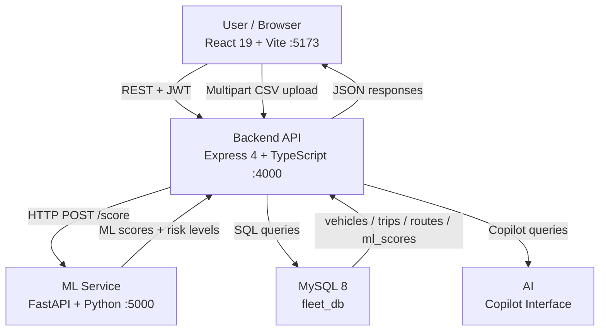

# Architecture

## System Architecture

YatraDrishti follows a three-tier architecture: a React SPA frontend, a Node.js/Express REST API backend, and a Python FastAPI ML microservice, backed by MySQL 8 for persistence.

## Components

| Component | Technology | Responsibility |
|---|---|---|
| Frontend | React 19 + Vite + TypeScript | Dashboard UI, fleet tables, analytics charts, CSV upload, AI Copilot chat |
| Backend API | Express 4 + TypeScript (port 4000) | REST API, JWT auth, CSV parsing & import pipeline, orchestrates ML scoring, MySQL queries |
| ML Service | FastAPI + Python 3 (port 5000) | Computes trip & vehicle risk scores (delay, fuel, traffic, behaviour, maintenance), returns `overall_score` + `risk_level` |
| Database | MySQL 8 | Stores users, drivers, vehicles, routes, trips, maintenance, risk_analysis, ml_scores |
| AI Copilot | FastAPI | Conversational AI layer — answers fleet queries, surfaces risk insights, runs inside the  platform |

## Data Flow

How data moves through the system from CSV upload to rendered dashboard:

1. **User uploads CSV** via the Data Center page — multipart POST to `POST /api/import/csv` with Bearer JWT
2. **Backend parses & validates** the CSV rows (7 required columns: `vehicle_id`, `route`, `distance_km`, `expected_time`, `actual_time`, `fuel_used`, `traffic`)
3. **Vehicles & routes are upserted** into MySQL — new entities are auto-created if the CSV references IDs not yet in the DB
4. **Trip rows are inserted** with computed `delay_min`, `status`, and initial `risk` derived from delay thresholds
5. **ML scoring batch request** is sent to `POST http://localhost:5000/score/trips/batch` — the FastAPI service scores each trip across five dimensions and returns `overall_score` + `risk_level`
6. **Vehicle-level ML scoring** runs a second batch `POST /score/vehicles/batch` — aggregates per-vehicle fuel efficiency, traffic exposure, and incident count
7. **ML scores are persisted** into the `ml_scores` table (entity_id, entity_type, sub-scores, risk_level, risk_factors, recommendations)
8. **Import result is returned** to the frontend — includes `rows_imported`, `ml_scores[]`, `vehicle_ml[]`, `fleet_summary`
9. **Frontend stores the import result** in `DataRefreshContext` — all pages (Dashboard, Analytics, Fleet, Trips) instantly show real data from the import without waiting for separate API round-trips
10. **Subsequent page fetches** hit `/api/analytics/*`, `/api/vehicles`, `/api/trips` etc. with the refreshed `refreshKey` to pull persisted data from MySQL

## Security Considerations

- All API routes (except `/api/auth/*` and `/api/import/sample`) require a valid `Authorization: Bearer <JWT>` header — enforced by the `authMiddleware` Express middleware
- JWT secret is read from the `JWT_SECRET` environment variable, never hard-coded or committed to git
- Passwords are hashed with `bcryptjs` (cost factor 10) before storage; plain passwords are never stored
- Database credentials (`DB_HOST`, `DB_PORT`, `DB_USER`, `DB_PASSWORD`, `DB_NAME`) are read from `.env` — the `.env` file is in `.gitignore`; only `.env.example` is committed
- CORS is restricted to explicit origins (`localhost:5173`, `localhost:4173`, and the optional `FRONTEND_URL` env var) — wildcard `*` is not used
- File uploads are limited to 10 MB and validated for `.csv` extension + MIME type before processing

## Scalability Notes

The Express backend is stateless (no in-memory session) so it can be horizontally scaled behind a load balancer once the MySQL instance is replaced with a managed cluster (e.g., PlanetScale or Amazon RDS). The ML service is the compute bottleneck — trip/vehicle payloads are already sent as batch arrays (`/score/trips/batch`, `/score/vehicles/batch`) so the FastAPI service can be scaled independently or replaced with a watsonx.ai inference endpoint without changes to the backend contract. The React frontend is a pure static SPA and can be deployed to a CDN (e.g., IBM Cloud Object Storage + CDN) for zero-latency global delivery.
